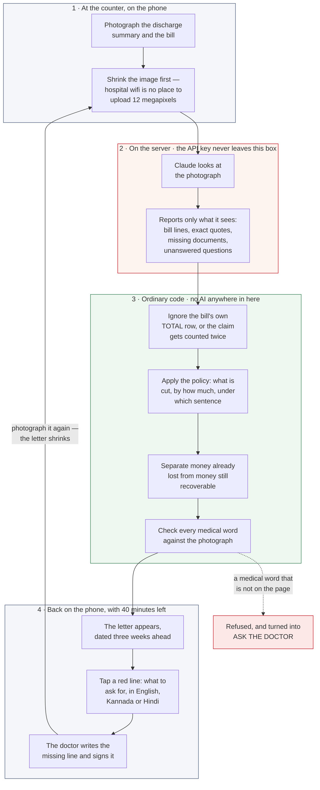

# POSTDATED

> **We send you the insurance rejection letter three weeks before the insurer does —
> while the doctor is still in the building and the paperwork can still be fixed.**

**Live: [postdated.vercel.app](https://postdated.vercel.app)** ·
Printable test case: [/summary](https://postdated.vercel.app/summary)

Built for Push to Prod (Anthropic × Elevation Capital, Bengaluru, 8 August 2026).

---

## What happens today

Ravi's father has his gallbladder removed at a private hospital in Bengaluru. Four
nights. The final bill is ₹2,40,000. The insurance covers up to ₹5,00,000, so Ravi
assumes he is fine. He pays, takes his father home, and files the claim.

Three weeks later a message arrives. **₹1,73,000 will not be paid.** The insurer will
pay ₹67,000.

By then the file is closed, the surgeon is on leave, and the ward records have been
archived. Nothing can be changed.

Now split that ₹1,73,000 by *why* it was refused, because the two halves are completely
different problems:

| | | |
|---|---|---|
| **₹48,000** | Ravi's father was put in a nicer room than the policy allowed, and some items on the bill are never covered by anyone | **Already lost.** The room was chosen four days ago. Nothing can bring this back. |
| **₹1,25,000** | Two documents were never handed over, and one sentence was never written down | **Recoverable** — but only for about forty more minutes |

Read that again: **nobody in this story did anything wrong.** The hospital treated the
patient. The insurer applied the contract it wrote. Ravi paid his premiums. And
₹1,25,000 evaporated because a piece of paper was thin and nobody mentioned it while it
could still be fixed.

That is the real problem. Three parties stand at the table, and only one of them has
never read the rules — and that one carries all the loss.

**Everyone who works on this problem today works on it after the refusal arrives.**
Claim consultants, complaint tribunals, appeal services. All of them are downstream of a
door that has already closed. Nobody is standing at the discharge counter in the forty
minutes when the document can still be changed and the doctor is still reachable.

Moving to that moment is the entire idea.

## What it does

Photograph the discharge summary and the bill at the counter. About thirteen seconds
later, the refusal letter appears on the phone — **dated three weeks in the future**,
itemised, in rupees.

Tap any red line and it tells you what to physically do about it, in English, Kannada or
Hindi, in type large enough to hold the phone up to a ward clerk. There are only ever two
kinds of instruction:

1. **Go and ask for a document.** *"Ask the nursing station for the ward's day-by-day
   record."*
2. **Ask the doctor a question.** *"Ask the treating doctor to write down why admission
   was necessary, and sign it."*

The doctor writes the line in and signs it. You photograph the paperwork again. The
letter shrinks, the fixed lines are struck through, and the total falls.

You are not being given advice. You are being handed the other side's letter, and then
allowed to edit the past until the letter changes.

The lines that cannot be fixed are shown anyway, marked plainly as **"this money is
gone."** That honesty is doing real work — it is the reason anyone believes the lines
that *can* be fixed.

## How it works



Two things about that picture are the whole design.

**The money is calculated by ordinary code, and we say so out loud.** Claude never
touches a rupee. It reads a photograph and reports what it sees. Every subtraction,
every ratio, every total is done by a plain function you can read in about five minutes,
sitting next to the sentence of the insurance contract it implements. If the arithmetic
were done by the model, no number on that letter could be defended.

**Everything the model writes is checked against the photograph before it is shown.**
That is the green box's last step, and the next section is about why.

## The one rule

**The system never writes a medical fact.** Not a symptom, not a diagnosis, not a reason
for treatment.

This matters more than anything else here. An earlier version of this idea had the app
improve the wording of the medical record — turning *"patient advised admission"* into
*"oral treatment failed, intravenous antibiotics required."* That is coaching people to
inflate medical records for money. It would deserve to be shut down, and one sentence
from anyone in the room would have ended it.

So the system does two things and no others: it asks for documents, and it asks the
doctor questions. The doctor answers. The doctor signs. Nobody else writes anything.

`lib/guard.ts` enforces this mechanically. Every medical word in anything the system
produces must appear on the photographed page, or on a list the doctor has personally
confirmed. Anything else is refused and turned into a red **ASK THE DOCTOR** note.

It is careful about one thing in particular. The test page says *"No history of fever or
jaundice."* A naive check would search for the word "fever", find it, and cheerfully let
the system claim the patient had a fever. This one reads the "no" — so if you ask it to
add a fever, it refuses and shows you that exact sentence as the reason.

The refusal is not an error page. It is something to demonstrate on purpose.

## Why Claude, specifically

Take Claude out and there is no product left — not a worse one, none.

- **A discharge summary is a piece of paper.** There is no data feed for it, and there
  never will be. It is nine-point type, three pages, handwriting in the margins,
  abbreviations, photographed at an angle under bad light. Reading that is the entry
  point and there is no alternative to it.
- **Insurance policies are forty-page documents written in prose.** Different per
  insurer, different per year. There is no table to look up.
- **The core judgement is not a lookup.** "Would the person who reviews claims at this
  company accept this as written?" is not recorded anywhere. No rules engine produces it.
- **Sounding like the insurer is the product.** A letter that reads like a real refusal
  letter changes behaviour. A friendly warning does not.

## What we are honest about

- **The refusal figures come from one real policy**, read by hand: Niva Bupa ReAssure
  2.0. It was chosen because its wording lists exactly four charges affected by a room
  upgrade and then stops — no "and so on". Every line of a bill can be sorted into
  affected or unaffected with no guesswork. Two competing policies were read and
  rejected for the comparison: one is wider, and one says "etc.", which means implementing
  it would mean *deciding* what "etc." covers — and that decision would secretly be the
  arithmetic.
- **That policy has no room limit at all by default.** It advertises "we don't limit your
  choice." The limit exists only because the test customer bought an optional add-on that
  puts a room category on their certificate. Remove that one line and the ₹48,000 half of
  this example correctly disappears — there is a test that checks it does.
- **We do not claim accuracy. We claim coverage.** We hand-read 40 published complaint
  rulings and counted 24 distinct reasons insurers refuse claims. We can see 4 of them
  fully, 12 partly, and 8 not at all. The three most common reasons are among the 8 we
  cannot see, because they need a form signed years before the hospital visit. So this
  does not predict outright rejection. It predicts the slice quietly shaved off claims
  that *do* get paid — which is the far more common thing, and which nobody escalates
  because it is not worth eighteen months of complaint procedure.
- **The published rulings run 2004 to 2014.** Nothing after about 2016 is available.
- **This is Claude reasoning like a claims reviewer. It is not trained on real
  accept/reject decisions**, because the insurers hold those and will not share them. We
  do not know how often it wrongly says a claim is fine. That number is unmeasured and we
  say so before anyone asks.
- **The letter is watermarked.** *PREDICTED — NOT ISSUED BY NIVA BUPA*, across the page
  and again at the bottom. It is a forecast, and it says so even in a photograph of it.
- **No medical documents are stored.** A photographed discharge summary can reveal things
  a patient never consented to share, about a patient who is often sedated. Nothing is
  kept after the page is closed.

## What is not built

The business is selling this to hospital insurance desks, not to families — the desk
already pays someone to guess at this by hand, and keeps their guesses in a private Word
document. That side is described in the pitch and deliberately not built: it was cut on
purpose to make the consumer half work properly in the time available. See
`BUILD-TODAY.md` for what was cut and why.

## Current safety boundary

This repository is currently a mock/demo and offline-evaluation build. The committed sample
paperwork is fictional. The public path accepts only explicitly allowlisted `fake-demo`
documents; an approved anonymised document requires an explicitly enabled provider, and a
provider failure remains a visible failure rather than becoming the seeded case.

The AWS path in `infra/pilot/` is a separate, disabled-by-default fake-challenge shell. It is
not the hospital pilot and it does not authorize real patient-document processing. AWS/SAM
tooling is not required to run the mock demo or its local tests.

The full [issue #9 strict shadow-pilot specification](https://github.com/sivaratrisrinivas/postdated/issues/9)
applies before any real upload: named accounts and MFA, consent and notice, approved provider
and transfer terms, retention and deletion evidence, patient-free audit and stop controls,
independent evaluation, and the hospital's contractual and operational approvals. Keep real
uploads disabled until every applicable gate is evidenced for the exact deployed version.

## The files

| Path | |
|---|---|
| `DEMO.md` | The runbook — what to click, every number, what to say, what to do when something breaks |
| `POSTDATED.md` | The full brief this was built from |
| `BUILD-TODAY.md` | What got cut when it became a one-person build, and why |
| `CONTEXT.md` | The shared vocabulary, including four phrases we never use and the specific damage each one does |
| `public/samples/` | The test paperwork: a photograph to upload, and an A4 PDF to print |
| `docs/research/` | Two research passes against original sources: the policy wordings, and the complaint rulings |
| `lib/deduct.ts` | Every calculation. 24 tests |
| `lib/guard.ts` | The check that stops the system inventing medical facts. 14 tests |
| `lib/policy.ts` | The policy, as read by hand from the wording |
| `app/api/extract/route.ts` | Public fake/anonymised intake; the key stays server-side |
| `infra/pilot/` | Separate AWS Mumbai pilot deployment, disabled by default |

## Trying it in one minute, without installing anything

The test case is a fictional patient, so there is nothing sensitive in these files.

1. Open **[postdated.vercel.app](https://postdated.vercel.app)** — on a phone if you have
   one to hand.
2. Download the sample paperwork:
   **[discharge-summary-photo.jpg](https://postdated.vercel.app/samples/discharge-summary-photo.jpg)**
   — a photograph of the printed page, taken at a slight angle in poor light, which is
   what the real input looks like. On a phone, long-press the image and save it.
3. Tap **Photograph the discharge summary**, and pick that file instead of taking a photo.
4. Wait about fifteen seconds without tapping anything. You should get:

   ```
   Amount claimed      ₹2,40,000
   Amount approved        ₹67,000
   TOTAL DISALLOWED    ₹1,73,000     ← five red lines below it
   ```

   The small line above the letter should read **"read live from the photograph"**. If it
   says "seeded case" instead, the network or the key failed and you are seeing the saved
   example — everything still works, it just did not read your file.
5. Tap the **₹85,000** line. Switch to **ಕನ್ನಡ**. That is the sheet you would hold up to
   a ward clerk.
6. Tap **Ward handed it over**. The total should fall to **₹88,000** and that line should
   turn green and strike through.
7. Scroll down to **Fabrication guard** and tap *"Patient had a fever on admission"*. It
   refuses, and shows you the sentence on the page that made it refuse.

**Want the paper version?** Print
**[discharge-summary.pdf](https://postdated.vercel.app/samples/discharge-summary.pdf)** at
A4, 100% scale. It fits one sheet on purpose, so the whole thing lands in a single
photograph. Lay it on a table and use the camera for real.

## Running it on your own machine

**You need:** Node.js 20 or newer, and — optionally — an Anthropic API key from
[console.anthropic.com](https://console.anthropic.com). Without a key it still runs; it
just shows the saved example instead of reading your photo.

```sh
# 1 — get the code
git clone https://github.com/sivaratrisrinivas/postdated.git
cd postdated

# 2 — install (about a minute)
npm install

# 3 — add your key, if you have one
echo 'ANTHROPIC_API_KEY=sk-ant-...' > .env.local

# 4 — start it
npm run dev
```

Then open **http://localhost:3000** and follow steps 3 to 7 above. The sample files are
already in the repo at `public/samples/`, so you can pick them straight off disk.

The public demonstration accepts only fake or fully anonymised documents. Its extraction
route requires an explicit `fake-demo` mode, an approved document manifest, and no access to
the protected pilot deployment. Configure each public document as
`POSTDATED_PUBLIC_DEMO_DOCUMENTS=<id>:<fake|anonymised>:<sha256>,...`. The document id and kind
are an operator attestation that must be reviewed before deployment; a digest alone cannot prove
that a document is fake. Unknown uploads are rejected visibly and never become the seeded case.
Only an approved `fake` document may use the seeded fixture. An approved `anonymised` document
requires `POSTDATED_PUBLIC_DEMO_LIVE=true` and `ANTHROPIC_API_KEY`; provider failure returns a
visible error rather than synthetic output.

The protected pilot is not a Next route. Deploy `infra/pilot/template.yaml` to the approved AWS
account and Mumbai region. It is disabled by default and accepts only authenticated
`fake-challenge` submissions through the separate HTTP API. Set `PilotEnabled=false` and
`ProviderApproved=false` until every issue #9 gate is complete. The deployment requires distinct
`PilotUsers=user-id=long-random-token` credentials and
`FakeChallenges=fake-challenge-1=<sha256>` values; each request sends both `X-Pilot-User` and
`Authorization: Bearer ...`. It uses the Bedrock adapter, keeps application errors patient-free,
and does not fall back to the public fixture.

Two other things worth running:

```sh
npm test          # money, boundary, and medical-word checks
npm run build     # what gets deployed
```

If you want to read one file to understand the whole thing, read `lib/deduct.ts`. It is
every calculation the letter is based on, and each one sits next to the sentence of the
insurance contract it comes from.
